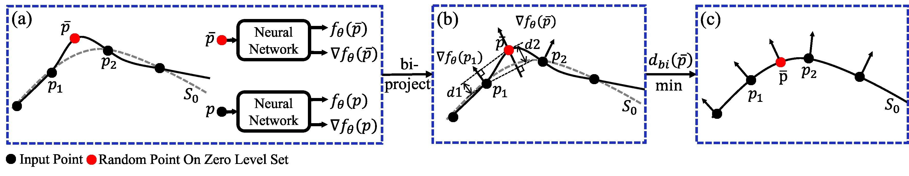
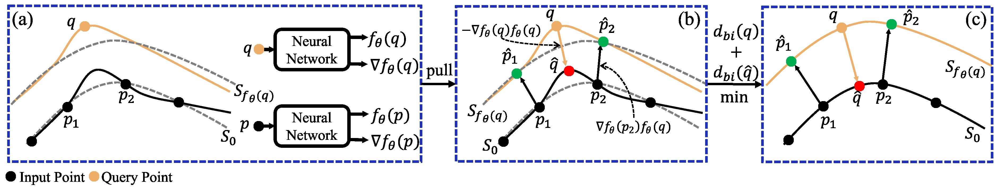
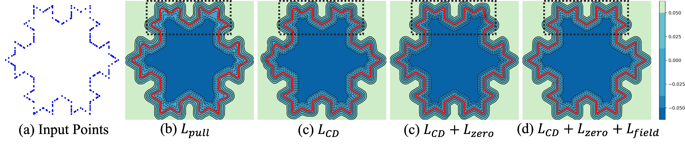
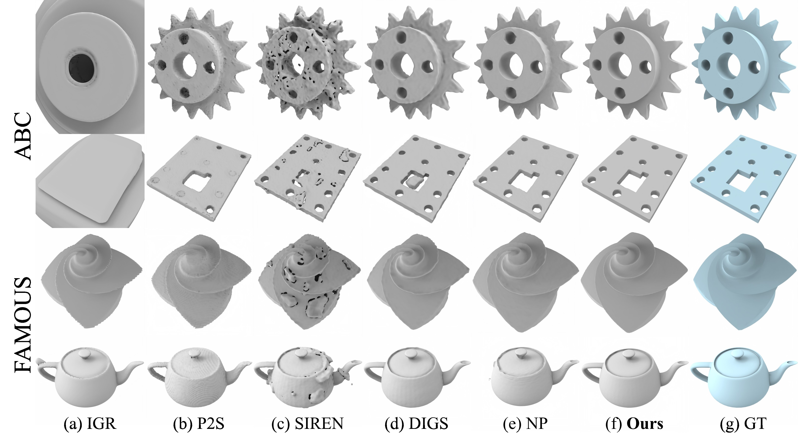

## Implicit Filtering for Learning Neural Signed Distance Functions from 3D Point Clouds

This repository contains the official pytorch version code for the paper.
[Implicit Filtering for Learning Neural Signed Distance Functions from 3D Point Clouds](https://arxiv.org/abs/2407.13342).

You can find detailed usage instructions for training your own models or running our provided demo below.

If you find our code or paper useful, please consider citing
```
@inproceedings{ImplicitFilter,
  title={Implicit Filtering for Learning Neural Signed Distance Functions from 3D Point Clouds},
  author={Shengtao Li and Ge Gao and Yudong Liu and Ming Gu and Yu-Shen Liu},
  booktitle={European Conference on Computer Vision (ECCV)},
  year={2024}
}
```

## Overview

         <p>
          Overview of filtering the zero level set. (a) We assume all input points lying on
          the surface and compute gradients as normals. (b) Calculating bidirectional projection
          distances  $d1=|n_{p_j}^T({\bar{p}} - {p}_j)|$, $d2 = |n_{\bar{p}}^T(\bar{p} - p_j)|$ and the weights in Eq. (4). (c) By
          minimizing Eq. (4), we can remove the noise on the zero level set. The gradient $∇f_θ$
          in this figure defaults to be regularized.
         </p>
         
         <p>
          Overview of sampling points. (a) Sampling query points near the surface. (b)
Pulling the query point to the zero level set and input points to the level set where the
query point is located. (c) Applying the filter on each level set. The gradient $∇f_θ$ in
this figure defaults to be regularized.
         </p>


## Demo results
### 2d Demo


### 3d Demo


## Installation:
Our code is implemented in Python 3.8, PyTorch 1.11.0 and CUDA 11.3.
- Install python Dependencies
```bash
conda create -n implicitfiltering python=3.8
conda activate implicitfiltering
conda install pytorch torchvision torchaudio cudatoolkit=11.3 -c pytorch
pip install tqdm pyhocon==0.3.57 trimesh PyMCubes scipy point_cloud_utils==0.29.7
```
- Compile C++ extensions
```bash
cd extensions/chamfer_dist
python setup.py install
```

## Data:
Surface Reconstruction from Point Cloud. 

We provide the demo data in `data/3DBenchy.xyz`. If you want to reconstruct your own data, please:
- Put your point cloud data on `./data`.
- Note that we support the point cloud data format of `.ply` and `.xyz`.

## Usage:
```python
python run.py --gpu 0 --conf confs/shape.conf --dataname 3DBenchy --dir 3DBenchy
```
You can find the generated mesh and the log in `./outs`.

## License
This project is open sourced under MIT license.
