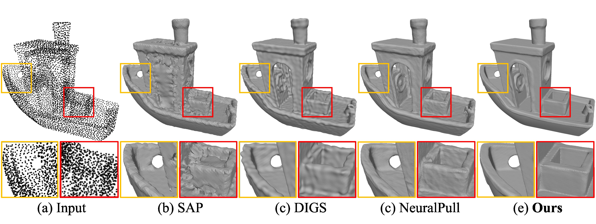

## Implicit Filtering for Learning Neural Signed Distance Functions from 3D Point Clouds

This repository contains the official pytorch version code for the paper.
[Implicit Filtering for Learning Neural Signed Distance Functions from 3D Point Clouds](https://arxiv.org/abs/2407.13342).

You can find detailed usage instructions for training your own models or running our provided demo below.

If you find our code or paper useful, please consider citing
```
@inproceedings{ImplicitFilter,
  title={Implicit Filtering for Learning Neural Signed Distance Functions from 3D Point Clouds},
  author={Shengtao Li and Ge Gao and Yudong Liu and Ming Gu and Yu-Shen Liu},
  booktitle={European Conference on Computer Vision (ECCV)},
  year={2024}
}
```

## Surface Reconstruction Demo
<p align="left">
  
</p>

## Installation:
Our code is implemented in Python 3.8, PyTorch 1.11.0 and CUDA 11.3.
- Install python Dependencies
```bash
conda create -n implicitfiltering python=3.8
conda activate implicitfiltering
conda install pytorch torchvision torchaudio cudatoolkit=11.3 -c pytorch
pip install tqdm pyhocon==0.3.57 trimesh PyMCubes scipy point_cloud_utils==0.29.7
```
- Compile C++ extensions
```bash
cd extensions/chamfer_dist
python setup.py install
```

## Data:
Surface Reconstruction from Point Cloud. 

We provide the demo data in `data/3DBenchy.xyz`. If you want to reconstruct your own data, please:
- Put your point cloud data on `./data`.
- Note that we support the point cloud data format of `.ply` and `.xyz`.

## Usage:
```python
python run.py --gpu 0 --conf confs/shape.conf --dataname 3DBenchy --dir 3DBenchy
```
You can find the generated mesh and the log in `./outs`.

## License
This project is open sourced under MIT license.
